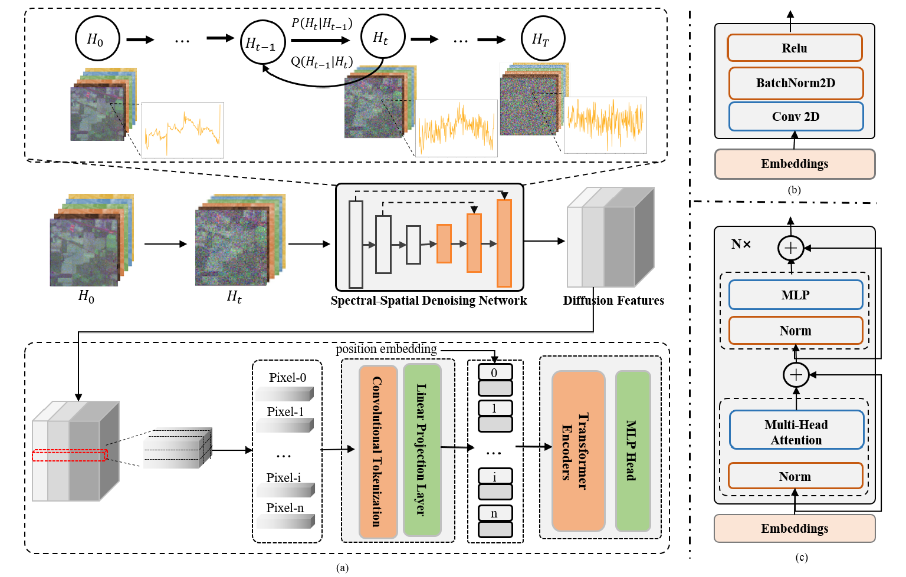

# SpectralDiff: A Generative Framework for Hyperspectral Image Classification with Diffusion Models

[Ning Chen](), [Jun Yue](), [Leyuan Fang](), [Shaobo Xia]()
___________

The code in this toolbox implements the ["SpectralDiff: A Generative Framework for Hyperspectral Image Classification with Diffusion Models"](https://ieeexplore.ieee.org/document/10234379). 

**The codes for this research includes two parts, [spectral-spatial diffusion module](https://github.com/chenning0115/spectraldiff_diffusion/) and [attention-based classification module](https://github.com/chenning0115/SpectralDiff#spectraldiff). This repository is for the attention-based classification module.**

More specifically, it is detailed as follow.



Citation
---------------------

**Please kindly cite the papers if this code is useful and helpful for your research.**
Will be supplemented soon.


How to use it?
---------------------
1. Prepare raw data and diffusion features
   * Raw data is origin HSI data, likes IP, PU, SA datasets, You need to separate the training and test sets in advance. Or you can download ours from [here]().
   * The classification module requires providing the features extracted by the diffusion module as input. We provide the diffusion features extracted in our experiments for researchers to reproduce the results. Please download the specific data from [here]().
   * To train a diffusion model by yourself, you can use this code repository [spectral-spatial diffusion module](https://github.com/chenning0115/spectraldiff_diffusion/). 
2. Modify the path of diffusion features in the params to ensure that the code can read them.
3. Run the code
   ```
   python workflow.py
   ```

Others
----------------------
If you want to run the code in your own data, you can accordingly change the input (e.g., data, labels) and tune the parameters.

If you encounter the bugs while using this code, please do not hesitate to contact us.

Licensing
---------

Copyright (C) 2023 Ning Chen

This program is free software: you can redistribute it and/or modify it under the terms of the GNU General Public License as published by the Free Software Foundation, version 3 of the License.

This program is distributed in the hope that it will be useful, but WITHOUT ANY WARRANTY; without even the implied warranty of MERCHANTABILITY or FITNESS FOR A PARTICULAR PURPOSE. See the GNU General Public License for more details.

You should have received a copy of the GNU General Public License along with this program.

